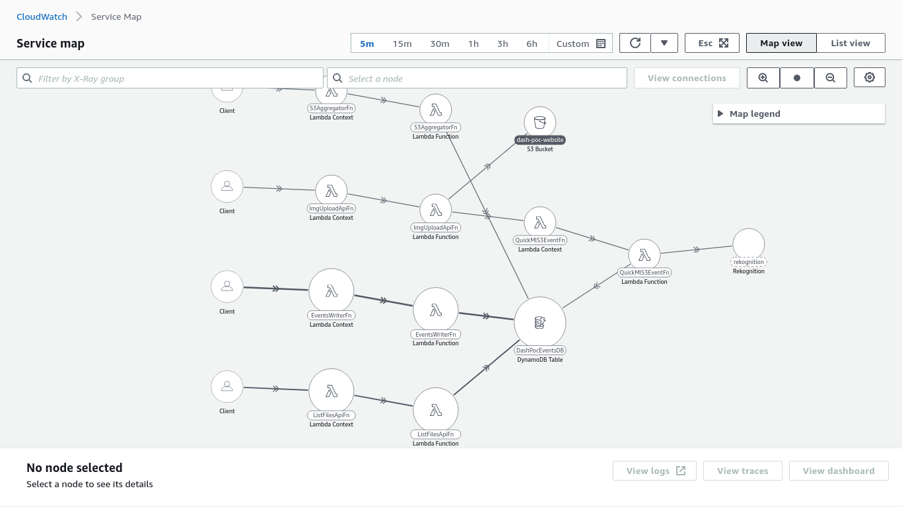

# CDK app for Monitoring Serverless Resources with cloudwatch

This is a POC application that is deployed for testing monitoring various serverless services.

## What services are deployed

- A fleet of Lambda function
- An S3 bucket for storing archival assets (private)
- DynamoDb Table
- A Static Website in S3 bucket (public)
- API Gateway
- Cloudwatch Dashboard with multiple widgets

## Architecture

### Explanation

**Lambda function DBWriterFn** is triggered at every 1 min by **aws event bridge** and writes an event into **aws dynamodb**. Another lambda function **AggregatorFn** is triggered at every 5 min by aws event bridge and picks up all data that arrived in last 5 mins in the dynamodb stitches them together and stores it in AWS s3 bucket. (to depict something like an event data archival.)

A React app **Image uploader app** is deployed in **AWS S3** using static website hosting. It only allows GET access. This frontend calls APIs created by **aws API Gateway** that triggers lambda functons that uploads image to website bucket as multipart/form-data. (to depict serverless image uploader)

As soon as a new file arrives an s3 event triggers a lambda function that calls **aws rekognition** and runs detect labels on the image and save the labels in **dynamodb** against video ID.

API Gateway exposes 2 APIs:

- **POST /upload:** Used for uploading the image to s3 as multipart/form-data or binary file.
- **GET /files:** Used for getting the list of images uploaded and processed on that day.

- API Gateway has CORS enabled to only allow s3 bucket server.

### X-Ray, Lambda Insights and Cloudwatch EMF custom Metric collection

Lambda Insights and custom metric collection is built into the applcation. Layers are used for adding any required dependency.

## Learnings

- Writing IAC using AWS CDK.
- Collecting all types of metrics available for lambda functions.
- Different trigger sources for AWS Lambda (APIG, S3 and EventBridge)
- Creating dashboards and widgets
- S3 static website hosting
- Image Label deletection using AWS Rekognition
- Dynamodb Single Table design and Item Overloading

## W.I.P

- Cognito Auth for frontend
- SQS in between s3 trigger and recognition worker lambda to support fan-out.
